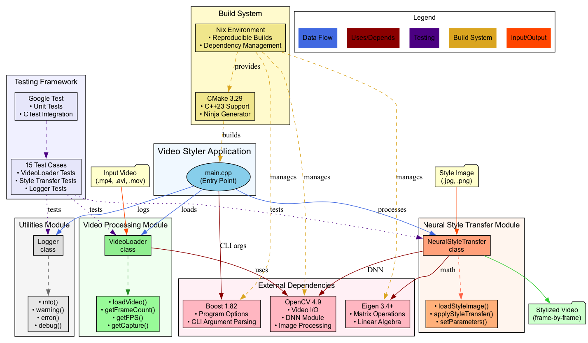

 Video Styler

A modern C++23 application that applies Neural Style Transfer to videos frame-by-frame using OpenCV and cutting-edge development tools.

## Features

- **Neural Style Transfer**: Frame-by-frame video transformation using OpenCV DNN
- **Modern C++23**: Leveraging the latest language features and best practices
- **Nix Environment**: Reproducible development environment with latest tool versions
- **Comprehensive Testing**: Google Test framework with VS Code Test Explorer integration
- **Cross-Platform**: Support for macOS (ARM64) and Linux development

## Quick Start

### Prerequisites
- [Nix package manager](https://nixos.org/download.html) with flakes enabled

### Build and Run

1. **Clone and enter development environment:**
   ```bash
   git clone <repository-url>
   cd video-styler
   nix develop
   ```

2. **Build the project:**
   ```bash
   mkdir -p build && cd build
   cmake -GNinja ..
   ninja
   ```

3. **Run tests:**
   ```bash
   ctest --verbose
   ```

4. **Run the application:**
   ```bash
   ./src/video_styler --input ../examples/input_videos/sample.mp4 \
                      --style ../examples/style_images/style.jpg \
                      --output ../examples/outputs/styled_video.mp4
   ```

## Development Environment

### Tool Versions (Updated August 2025)
- **CMake**: 3.29.2 (with modern policies and enhanced C++23 support)
- **LLVM/Clang**: 16.0.6 (full C++23 support with c++2b flag)
- **OpenCV**: 4.9.0 (enhanced DNN module, improved performance)
- **Boost**: 1.82 (program_options for CLI argument parsing)
- **Eigen**: 3.4+ (high-performance matrix operations)
- **Nix**: Stable 24.05 channel for reliable package management

### VS Code Integration

The project includes comprehensive VS Code integration:

#### Test Explorer Setup ✅
- Uses **CTest** (industry standard for CMake-based C++ projects)
- **CMake Tools extension** provides CTest integration
- Tests are discovered and executed through CTest in the Nix environment
- Access via the beaker (🧪) icon in the left sidebar

#### Available VS Code Tasks
- **"Configure CMake (Ninja)"** - Configure the project
- **"Build Debug (Ninja)"** - Build the project  
- **"Run Tests"** - Run all unit tests via CTest
- **"Build and Test"** - Full configure + build + test cycle

#### Usage
1. Build the project first using VS Code tasks or terminal
2. Open Test Explorer (beaker icon in left sidebar)
3. CTest automatically discovers all Google Test cases
4. Run tests individually or in groups
5. View detailed test output in terminal panel

## Architecture



*Complete system architecture showing modules, dependencies, data flow, and build system integration*

### Core Components

1. **Video Processor** (`src/video_processor/`)
   - `VideoLoader`: Handles video file loading and metadata extraction
   - Provides frame-by-frame access to video content

2. **Style Transfer** (`src/style_transfer/`)
   - `NeuralStyleTransfer`: Implements neural style transfer algorithms
   - Applies artistic styles to individual frames

3. **Utilities** (`src/utils/`)
   - `Logger`: Provides logging functionality with multiple levels
   - Utility functions for common operations

### Class Hierarchy

```
VideoStyler Application
├── VideoLoader
│   ├── loadVideo()
│   ├── getFrameCount()
│   ├── getFPS()
│   └── getCapture()
├── NeuralStyleTransfer
│   ├── loadStyleImage()
│   ├── applyStyleTransfer()
│   └── setParameters()
└── Logger
    ├── info()
    ├── warning()
    ├── error()
    └── debug()
```
## Project Structure

```
video-styler/
├── src/                    # Source files
│   ├── main.cpp           # Main application entry point
│   ├── video_processor/   # Video processing modules
│   ├── style_transfer/    # Neural style transfer implementation
│   └── utils/             # Utility functions (Logger, etc.)
├── include/               # Header files
│   ├── video_processor/   # Video processing headers
│   ├── style_transfer/    # Style transfer headers
│   └── utils/             # Utility headers
├── tests/                 # Unit tests (Google Test)
├── docs/                  # Architecture diagrams and documentation
│   ├── architecture.dot   # DOT source for architecture diagram
│   └── architecture.png   # Architecture diagram (generated)
├── examples/              # Example videos, styles, and outputs
│   ├── input_videos/      # Sample input videos for testing
│   ├── style_images/      # Sample style images for transfer
│   └── outputs/           # Generated output videos
├── .vscode/               # VS Code configuration (tasks, settings)
├── build/                 # Build directory (generated)
├── flake.nix             # Nix development environment
├── CMakeLists.txt        # CMake configuration
└── README.md             # This file
```

## Testing

### Running Tests

```bash
# Using CTest (recommended)
cd build
ctest --verbose

# Or run the test executable directly
./tests/video_styler_tests

# Run specific tests
./tests/video_styler_tests --gtest_filter="VideoLoaderTest.*"
```

### VS Code Test Explorer
- All 15 Google Test cases are discoverable through CTest
- Individual test execution with detailed output
- Integration with Nix environment for consistent execution
- Parallel test execution support

## Development

### Technology Stack
- **C++23**: Modern language features (concepts, ranges, coroutines)
- **Nix**: Reproducible development environment and dependency management
- **CMake + Ninja**: Fast, modern build system with CTest integration
- **Google Test**: Comprehensive unit testing framework
- **OpenCV**: Computer vision and DNN capabilities for style transfer
- **Eigen**: High-performance linear algebra operations
- **LLDB**: Debugging support optimized for ARM64 (macOS)

### Build System (CMake)
- Root `CMakeLists.txt`: Main project configuration with C++23 policies
- `src/CMakeLists.txt`: Source files and library linking
- `tests/CMakeLists.txt`: Test configuration with Google Test and CTest
- Ninja generator for fast parallel builds
- Explicit c++2b flag for Clang 16 compatibility

### Alternative Build Methods

#### Manual Terminal Build
```bash
# Enter Nix environment
nix develop

# Standard CMake workflow
mkdir -p build && cd build
cmake -GNinja ..
ninja
ctest --verbose
```

#### VS Code Tasks (Recommended)
Use `Ctrl+Shift+P` (Cmd+Shift+P on Mac) → "Tasks: Run Task":
- Full configure + build + test cycle available
- Proper Nix environment integration
- Optimized for development workflow

## Troubleshooting

### Nix Environment Issues
```bash
# Verify Nix environment works
nix develop --command echo "OK"

# Check tool versions
nix develop --command cmake --version
nix develop --command clang --version
```

### VS Code Test Explorer
1. Ensure project is built first: Run "Build Debug (Ninja)" task
2. Check CTest integration in CMake Tools extension
3. Refresh Test Explorer if tests don't appear
4. View Output panel → "CMake" for detailed information

### Build Issues
- **C++23 compatibility**: Ensure using c++2b flag with Clang 16
- **Library linking**: Verify OpenCV and Boost are properly linked
- **Nix dependencies**: Use stable nixpkgs 24.05 for consistency

## Contributing

1. Fork the repository
2. Create a feature branch (`git checkout -b feature/amazing-feature`)
3. Make your changes following C++23 best practices
4. Add tests for new functionality (maintain 100% test pass rate)
5. Ensure all tests pass: `ctest --verbose`
6. Commit your changes (`git commit -m 'Add amazing feature'`)
7. Push to the branch (`git push origin feature/amazing-feature`)
8. Open a Pull Request

## License

[Add your license here]
